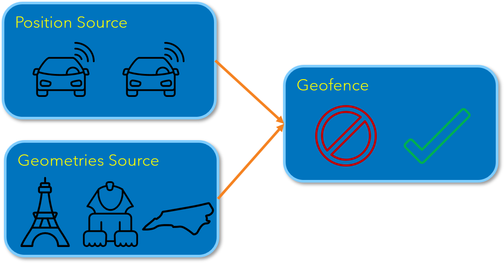

# Tracking the International Space Station
#### An Introduction to Geofences

## Overview

Welcome to the Tracking the International Space Station, an Introduction to Geofences ESP example. In this example you will get an introduction to the Geofence window including:

* How to define areas of interest for a geofence
* How to use the geofence window to detect a position within a circle
* How to use position proximity analysis to detect a position’s proximity to a polygon
* How to create a GEO Map in SAS ESP Streamviewer

### International Space Station

The International Space Station (ISS) is a modular space station in low Earth orbit. It maintains an altitude of 251 miles and completes an orbit of the Earth in about 93 minutes. The ISS makes 15.54 orbits per day and is travelling at 7.66 km/s (27,600 km/h; 17,100 mph). The API used by this project publishes the latitude and longitude of the ISS every 10 seconds.

### Geofence Overview

A geofence is a virtual perimeter for a real-world geographic area. The geofence can be defined in one of three ways:

* Set of coordinates with a radius (circle)
* Multiple sets of coordinates defining a bounding box (polygon)
* Multiple sets of coordinates defining a trip wire (polyline)

This example demonstrates the use of circles and ploygons to define areas of interest.

A geofence window requires two data sources as input. The position source window streams the geographic positions of one or more objects. The geometries source window provides definitions for areas of interest (geometries).

The geofence window functions like an outer join. When the coordinates for an event from the position source window is inside the definition of an area of interest, an output event is generated.

#### Circles

You use a set of coordinates and a radius to define a circle around an area of interest. You can use Cartesian (X,Y) or geographic (lat,long) coordinates. The radius is specified in meters.

The following are examples of circle definitions:

~~~csv
ID,Name,Lat,Long,Radius
1,Eiffel Tower,48.8584,2.2945,1500000
2,Colosseum,41.8902,12.4922,1750000
3,Statue of Liberty,40.6892,-74.0445,1500000
~~~

If the position of an object is outside the circle, the geofence window will not generate an output event. However, if the position is within the radius of the circle, an output event is created and the distance to the center of the circle is calculated. 

 

#### Polygons

You can also define a bounding box or polygon as your area of interest. A polygon is defined as multiple sets of coordinates that from a closed ring. This is done by using the same set of coordinates for the first and last entry of a definition.

Since each polygon will probably have a different number of coordinate sets, a single field can be used to specify all sets of coordinates. This field is referred to as datadef and is a string using spaces as delimiters.

The following is an example of a polygon definition.

~~~csv
ID,Name,Datadef
1,Poly1, “5.281 9.455 3.607 7.112 6.268 6.181 8.414 7.705 5.281 9.455 “ 
~~~

During normal operation, the geofence window outputs an event when the object is within the confines of the polygon. If the object is outside the polygon, no output event is generated.

 

#### Position Proximity Analysis

Position proximity analysis is an option that determines the proximity of an object to the closest segment of the polygon. When position proximity analysis is set to true, the geofence window outputs an event when the object is either inside the polygon, or within the radius defined as the proximity.

If the object is inside the proximity radius, the distance to the nearest polygon segment is calculated and output as a positive number. If the object is inside the polygon, the distance to the nearest polygon segment is again calculated, but output as a negative number.

 

### Model Description

Here is the model in ESP Studio. 

 

#### Source Windows

There are three source windows, **iss**, **regionsPoly**, and **landmarksCir**. The **iss** source window publishes the live position of the ISS once every 10 seconds using a URL connector. The URL connector is configured by the `config.xml` file. It specifies the API call to the server and then parses the JSON message returned.

The **regionsPoly** source window provides the polygon definitions for several regions of the world by reading the `countries2.csv` file. The **landmarksCir** source window publishes the coordinates and radius values for several world landmarks by reading the `landmarks.csv` file.

#### Geofence Windows

The model includes two Geofence windows, **geoCircle** and **geoProximityAnalysis**.

##### geoCircle Window

The **geoCircle** geofence window receives position events from the **iss** source window and geometry data from the **landmarksCir** source window. The **geoCircle** window outputs an event when the coordinates of the ISS are within the specific radius for a landmark.

There are two Geofence Algorithm Properties that are selected. The `Output multiple events if multiple geometry matches are found` property allows all events that meet the criteria to be output. If not selected, only the event with the smallest distance would be output. The `Sort output by closest geometry match` property causes the closest event to be output first (event number is 0).

The following table shows the output mapping for the **geoCircle** window:

| Role | Field |
| ------ | ------ |
| Geometry ID | geoId |
| Geometry description | cirDesc |
| Geometry distance | distToCenter |
| Event number | eventnum |

##### geoProximityAnalysis Window

The **geoProximityAnalysis** geofence window receives position events from the **iss** source window and geometry data from the **regionsPoly** source window. Because the `Enable polygon distance computation` and `Enable proximity detection for polygons` options are set, the **geoProximityAnalysis** window outputs an event when one of the following is true:

* The coordinates of the ISS are within the boundaries of the polygon. The distance value is negative and represents the number of meters to the closest polygon segment.
* The coordinates of the ISS are within the radius surrounding the polygon. The distance value is positive and represents the number of meters to the closest polygon segment.

There are two additional Geofence Algorithm Properties, `Output multiple events if multiple geometry matches are found` and `Sort output by closest geometry match` that are selected.

The following table shows the output mapping for the **geoProximityAnalysis** window:

| Role | Field |
| ------ | ------ |
| Geometry ID | geoId |
| Geometry description | polyDesc |
| Geometry distance | distToEdge |
| Event number | eventnum |

#### Filter Windows

There are four Filter windows used to segregate the output events into different categories.

The **inner1k** filter window receives input from the **geoProximityAnalysis** window and only outputs events if the `distToEdge` value is greater than 0 and less then or equal to 1,000,000 meters (1000 km). This represents the first 1,000,000 meters of the radius outside the polygon.

The **outer1k** filter window receives input from the **geoProximityAnalysis** window and only outputs events if the `distToEdge` value is greater than 1,000,000 meters (1000 km) and less than or equal to 2,000,000 meters (2000 km). This represents the outer 1,000,000 meters of the radius outside the polygon.

The **insidePoly** filter window receives input from the **geoProximityAnalysis** window and only outputs events if the `distToEdge` value is less than 0. This indicates the ISS is inside the polygon.

The **insideCir** filter window receives input from the **geoCircle** window and only outputs events if the `geoId` value is not null. This indicates the ISS is inside the circle.

#### Pattern Windows

The **approaching** and **departing** pattern windows receive events from the **inner1k** filter window. These are the events when the ISS is within 1000 km of a region.

The **approaching** pattern window detects events when the `distToEdge value` is getting smaller. `geoId` is used as the index for the pattern and field `dt` as the time field. The pattern uses two events of interest (EOI). The first EOI stores the value of `distToEdge` in binding variable `g0`. The second EOI determines if the current `distToEdge` value is less that the value stored in `g0`. If the first EOI and the second EOI occur within 30 seconds, output an event.

The **departing** pattern window is the same as the **approaching** window except the second EOI is looking for the `distToEdge` value to increase.

### GEO Maps

The following GEO Maps were created using SAS ESP Streamviewer. The upper left GEO Map is subscribed to the **iss** window and simply displays the latitude and longitude of the ISS as it tracks. The other two GEO Maps are subscribed to the geofence windows. In addition to latitude and longitude, they display distance values using the size and color of the circles.

### Prerequisites

[SAS Event Stream Processing 6.2](https://www.sas.com/en_us/software/event-stream-processing.html)

### Running

* Refer to the [Execute the Model](doc/execute/readme.md) document for steps to run this project.
* Refer to the [Create the GEO Maps in ESP Streamviewer](doc/geomap/readme.md) document for steps to create the GEO Maps for this project.
 
#### Running on the SAS Event Stream Processing Trial Environment

Refer to the [Executing the ISS Tracking Model (csv) on the Trial Environment](doc/trial/readme.md) document for instrcutions on running this project in the SAS Event Stream Processing Trial Environment.

## Contributing

> We welcome your contributions! Please read [CONTRIBUTING.md](CONTRIBUTING.md) for details on how to submit contributions to this project. 

## License

> This project is licensed under the [Apache 2.0 License](LICENSE).

## Additional Resources

* [SAS Event Stream Processing 6.2 Documentation](https://go.documentation.sas.com/?cdcId=espcdc&cdcVersion=6.2&docsetId=espov&docsetTarget=home.htm&locale=en)
* [Live Space Station Tracking Map](https://spotthestation.nasa.gov/tracking_map.cfm)
* [NASA](www.nasa.gov)
