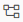
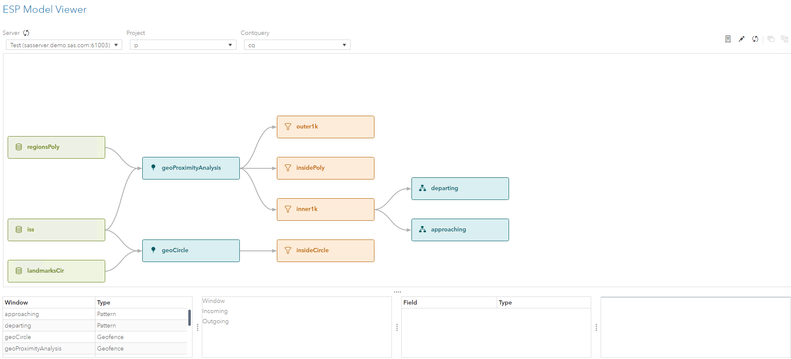
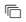
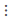
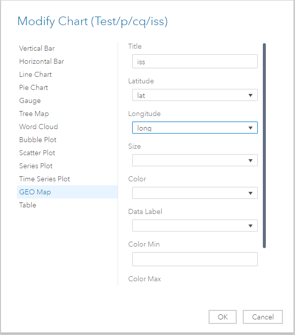
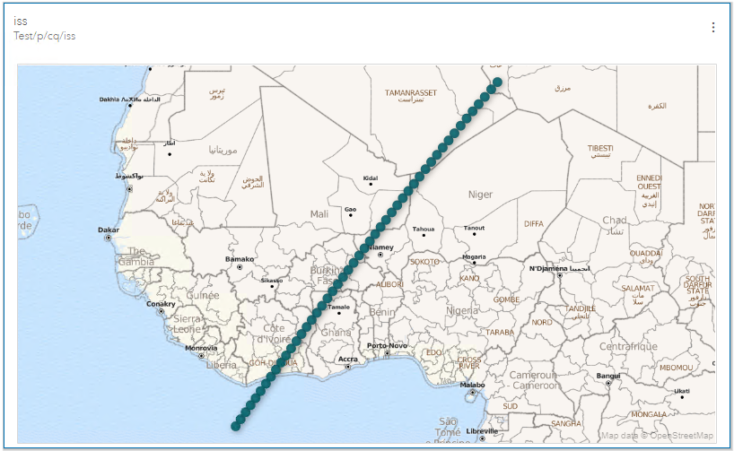
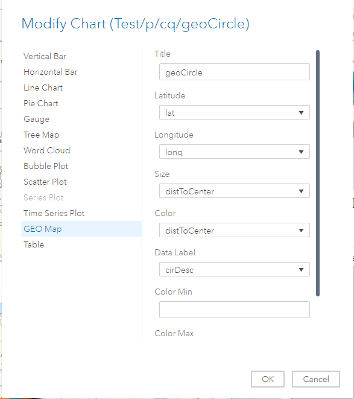
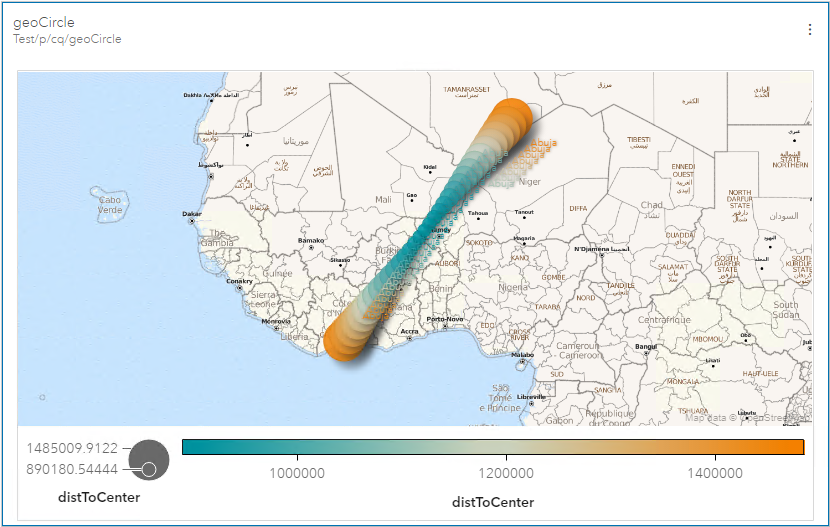
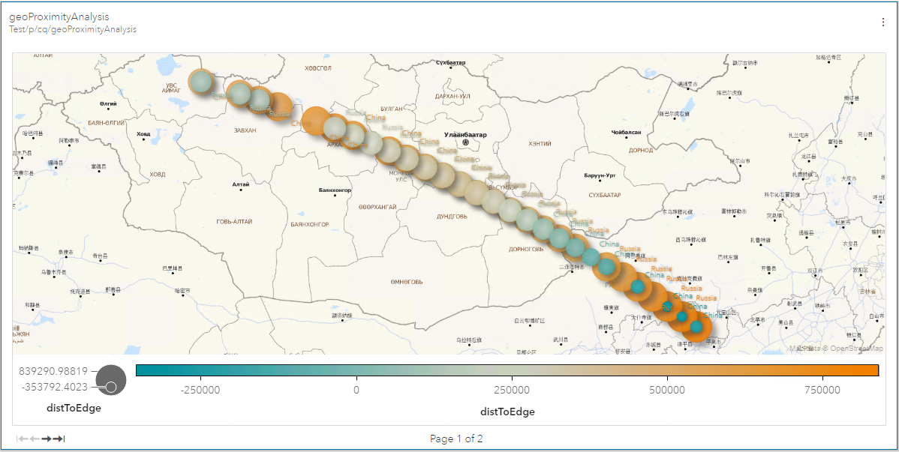

# Create the GEO Maps in SAS ESP Streamviewer

You can create the following GEO Maps to view the output using SAS ESP Streamviewer.

>   Ensure the model is executing on the SAS ESP XML Server.

Start SAS ESP Streamviewer.

## iss Window GEO Map

1. Click  to open the ESP Model Viewer.
 
    

2.  Click the **iss** window to select it and then click   to add an Updating Subscriber to the dashboard. Click **Close** to close the ESP Model Viewer. A table appears on the dashboard.

3.  In the upper-right corner of the table, click  and then select **Edit**. The Modify Chart screen appears.
 
    

4.  Select **GEO Map**.
  
5.  Select the appropriate variables as follows:

    |  |  |
    | ------ | ------ |
    | Latitude | lat |
    | Longitude | long |
    | Size | (blank) |
    | Color | (blank) |
    | Data Label | (blank) |
    
6.  Click **OK**. The GEO Map will appear and automatically adjust the zoom factor as more data appears. You can also manually adjust the zoom factor with the mouse wheel.

    
    
## geoCircle Window GEO Map

1. Click  to open the ESP Model Viewer.
 
2.  Click the **geoCircle** window to select it and then click   to add an Updating Subscriber to the dashboard. Click **Close** to close the ESP Model Viewer. A table appears on the dashboard.

3.  In the upper-right corner of the table, click  and then select **Edit**. The Modify Chart screen appears.
 
    

4.  Select **GEO Map**.
  
5.  Select the appropriate variables as follows:

    |  |  |
    | ------ | ------ |
    | Latitude | lat |
    | Longitude | long |
    | Size | distToCenter |
    | Color | distToCenter |
    | Data Label | cirDesc |
    
6.  Click **OK**. The GEO Map will appear and automatically adjust the zoom factor as more data appears. You can also manually adjust the zoom factor with the mouse wheel.

    
    
## geoProximityAnalysis Window GEO Map

1. Click  to open the ESP Model Viewer.
 
2.  Click the **geoProximityAnalysis** window to select it and then click   to add an Updating Subscriber to the dashboard. Click **Close** to close the ESP Model Viewer. A table appears on the dashboard.

3.  In the upper-right corner of the table, click  and then select **Edit**. The Modify Chart screen appears.
 
4.  Select **GEO Map**.
  
5.  Select the appropriate variables as follows:

    |  |  |
    | ------ | ------ |
    | Latitude | lat |
    | Longitude | long |
    | Size | distToEdge |
    | Color | distToEdge |
    | Data Label | polyDesc |
    
6.  Click **OK**. The GEO Map will appear and automatically adjust the zoom factor as more data appears. You can also manually adjust the zoom factor with the mouse wheel.

    
    
