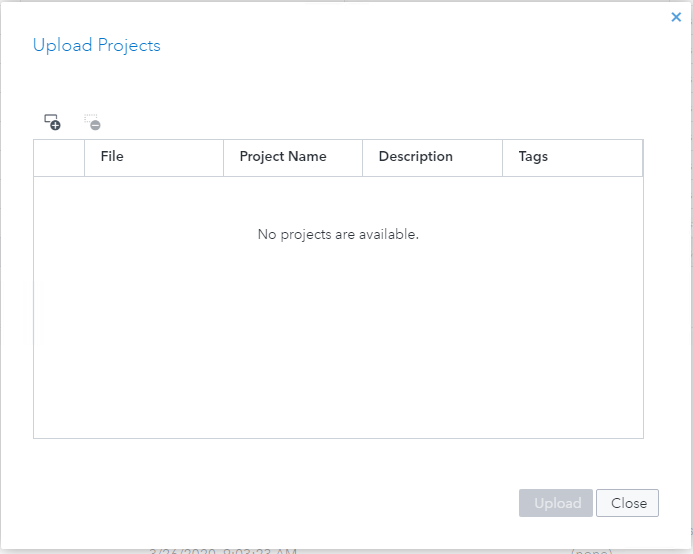

# Executing the ISS Tracking Model (csv) on the Trial Environment

## Table of Contents

* [Register for Free Trial](https://github.com/sassoftware/iot-tracking-the-iss/tree/master/doc/trial#register-for-free-trial)
* [Log onto Trial Environment](https://github.com/sassoftware/iot-tracking-the-iss/tree/master/doc/trial#log-onto-trial-environment)
* [Upload Data](https://github.com/sassoftware/iot-tracking-the-iss/tree/master/doc/trial#upload-data)
* [Access SAS ESP Studio](https://github.com/sassoftware/iot-tracking-the-iss/tree/master/doc/trial#access-sas-esp-studio)
* [Upload Model to SAS ESP Studio](https://github.com/sassoftware/iot-tracking-the-iss/tree/master/doc/trial#upload-model-to-sas-esp-studio)
* [Edit Input Data Connectors and Subscriber Connectors](https://github.com/sassoftware/iot-tracking-the-iss/tree/master/doc/trial#edit-input-data-connectors-and-subscriber-connectors)
	 * [Editing Input Data (Publisher) Connectors](https://github.com/sassoftware/iot-tracking-the-iss/tree/master/doc/trial#editing-input-data-(publisher)-connectors)
	 - [Editing Subscriber Connectors](https://github.com/sassoftware/iot-tracking-the-iss/tree/master/doc/trial#editing-subscriber-connectors)
* [Testing the Model in SAS ESP Studio](https://github.com/sassoftware/iot-tracking-the-iss/tree/master/doc/trial#testing-the-model-in-sas-esp-studio)
* [Enable Logging on the SAS ESP Server](https://github.com/sassoftware/iot-tracking-the-iss/tree/master/doc/trial#enable-logging-on-the-sas-esp-server)
* [Executing the Model on the ESP Server](https://github.com/sassoftware/iot-tracking-the-iss/tree/master/doc/trial#executing-the-model-on-the-esp-server)
* [View Model Output Using SAS ESP Streamviewer](https://github.com/sassoftware/iot-tracking-the-iss/tree/master/doc/trial#view-model-output-using-sas-esp-streamviewer)

## Register for Free Trial

1. Go to the [SAS Event Stream Processing](https://www.sas.com/en_us/software/event-stream-processing.html) home page.

2.	Click **Get Free Trial**.

3.	Follow the instructions…

## Log onto Trial Environment

Once registered, you will receive an e-mail message with a link to your environment in the SAS Cloud.

*Figure 1 - SAS Cloud E-mail Message*

Click the provided link and proceed to log onto the environment.

## Upload Data

After you have successfully logged in, you can upload the files required by the model. The `modelcsv.xml` model requires you to upload the following files:

- [config.xml](files/config.xml)
- [countries2.csv](files/countries2.csv)
- [iss_input.csv](files/iss_input.csv)
- [landmarks.csv](files/landmarks.csv)

1.	On the left side, click **Data**.
    *The Data Management Screen appears.*

    
    
    *Figure 2 - Data Management Screen*

2.	Click .
    *The Upload Files screen appears.*

    
    
    *Figure 3 - Upload Files Screen*

3.	Click **browse** and use standard Windows techniques to select the files you want to upload. 

4.	Click **Close** to close the Upload Files window.

The files are automatically uploaded to your account’s Uploads directory. The path to the directory is:

~~~bash
/home/your_email_address/uploads
~~~

## Access SAS ESP Studio

1.	On the left side of the SAS Cloud screen, click **Apps**.
    *The Applications screen appears.*

2.	Click **SAS Event Stream Processing**.
    *The Choose Interface screen appears.*

3.	Click **SAS ESP Studio** to start the application.

## Upload Model to SAS ESP Studio

You need to upload the `modelcsv.xml` file to SAS ESP Studio to access it there.

1.	In the upper-right corner of SAS ESP Studio, click  to reveal the More actions menu and select **Upload projects**.
    *The Upload Projects screen appears.*

    
    
    *Figure 4 - Upload Projects Screen*
    
2.	Click .

3.	Navigate to the xml file that contains the model that you want to upload and click **Open**.

4.	Click **Upload**. The file is uploaded, and the Upload Projects window displays the file, project name, and a green checkmark if the upload was successful.

5.	Click **Close** to close the Upload Projects window. The model appears using the Project Name specified in the model.

6.	Double-click the project to open it.
  
## Edit Input Data Connectors and Subscriber Connectors

You must edit any Input Data (Publisher) Connectors and Subscriber Connectors to specify the path to the files you uploaded and any files that will be created. The path includes the /home/your_email_address/uploads directory to which you uploaded files.

To determine if a window includes a connector, look for the  icon. If the icon appears on the left of a window it indicates an Input Data (Publisher) Connector exists. If the icon appears on the right of a window it indicates a Subscriber Connector.

The following is a list of windows that contain Input Data (Publisher) Connectors:

- iss
- regionsPoly
- landmarksCir

The following is a list of windows that contain Subscriber Connectors:

- geoProximityAnalysis
- geoCircle

### Editing Input Data (Publisher) Connectors

Use the following steps to edit an Input Data (Publisher) Connector:

1.	Ensure the Properties are displayed on the right side of the screen.

2.	Click the window containing the Input Data (Publisher) Connector to select it.

3.	Expand the **Input Data (Publisher) Connectors** section.

4.	Select the connector and click  to open the Connector Configuration window.

    
    
    *Figure 5 - Input Data Connector Configuration Screen*
    
5.	Edit the **Fsname** field to include the full path to the file.

6.	Click **OK** to close the Connector Configuration window.
    
### Editing Subscriber Connectors

Use the following steps to edit a Subscriber Connector:

1.	Ensure the Properties are displayed on the right side of the screen.

2.	Click the window containing the Subscriber Connector to select it.

3.	Expand the **Subscriber Connectors** section.

4.	Select the connector and click  to open the Connector Configuration window.

    
    
    *Figure 6 - Subscriber Connector Configuration Screen*
    
5.	Edit the **Fsname** field to include the full path to the file.

6.	Click **OK** to close the Connector Configuration window.

## Testing the Model in SAS ESP Studio

SAS ESP Studio allows you to test a model.

1.	Ensure the project is open in SAS ESP Studio.

2.	If necessary, click  to save your changes. A project must be saved before it can be tested.

3.	Click  to open the Test window.
	
    

    *Figure 7 - Test Window*
    
4.	Click  to begin the test. The model will start on the server and the connectors will begin publishing and subscribing.

    
    
    *Figure 8 - Test Executing*
    
5.	Click any of the tabs to view the output from that window.

6.	To stop the test, click .

## Enable Logging on the SAS ESP Server

If you receive an error or the connectors cannot start when you test a model, you can enable logging on the SAS ESP Server to view the messages from the log.

1.	Click **ESP Servers** to display the ESP Servers screen.

2.	Click the ESP Trial Server entry to select it, and then click  to open the properties for the server.

3.	Click **Enable logging on the ESP server** and then click **OK**.

4.	Run the test again with logging enabled.

## Executing the Model on the ESP Server

You can use the ESP Servers feature of SAS ESP Studio to execute a model on the ESP XML Server.

1.	Click **ESP Servers** to display the ESP Servers screen.

    
    
    *Figure 9 - ESP Servers Screen*
    
2.	On the bottom half of the screen, click  (Load project) to display the Load Projects screen.
	
    

    *Figure 9 - Load Project Screen*
    
3.	Select the appropriate project and click **Load**.
    *The project appears under Projects on the ESP Servers screen.*

4.	Click the project to select it, and then click  to start the project on the SAS ESP Server. The status indicator turns green.
    
## View Model Output Using SAS ESP Streamviewer

You can use SAS ESP Streamviewer to subscribe to windows in the model and view the output.

1.	Ensure the model is running on the SAS ESP Server.

2.	On the left side of the SAS Cloud screen, click **Apps**.
    *The Applications screen appears.*

3.	Click **SAS Event Stream Processing**.
    *The Choose Interface screen appears.*

4.	Click **SAS ESP Streamviewer** to start the application.
    *SAS ESP Streamviewer starts, and a new dashboard appears.*

    
    
    *Figure 10 - New Dashboard*
    
5.	Click  to open the ESP Model Viewer.

6.	Select the appropriate window and click  to add an updating subscriber to the dashboard. Click **Close** to close the ESP Model Viewer.

7.	You can click   In the upper-right corner of the table and then select Edit to change the display type to a chart or graph.
